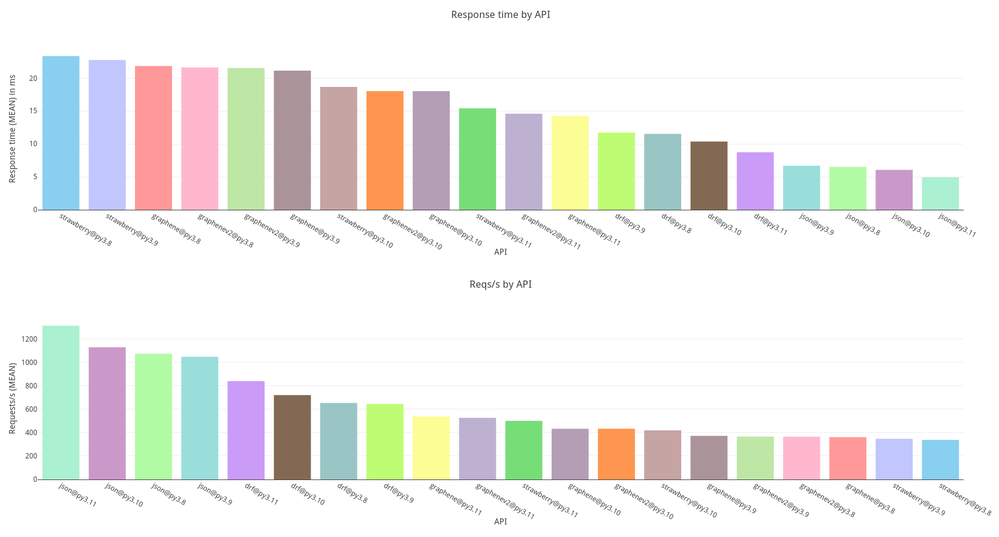

# django-graphql-benchmarks
Fork of [jkimbo/django-graphql-benchmarks](https://github.com/jkimbo/django-graphql-benchmarks).
The original project proved useful for discussions about graphene's performance (e.g. in [graphql-python/graphene#268](https://github.com/graphql-python/graphene/issues/268)).
To provide an up-to-date insight into the matter I revived the project.

## differences to jkimbo/django-graphql-benchmarks
The Django app is no longer bound to be deployed on Heroku, but is built as a Docker container. This allows for deployment anywhere (including the very cost-efficient "localhost").
`main` runs on up-to-date dependencies, Python 3.10 and graphene v3.
`main_graphenev2_only` is (or should) always the same as `main`, but only exposes a GraphQL endpoint provided by graphene v2.

## setup + running
Prerequisites for running the benchmarks:
1. A local version of the `main` and `main_graphenev2_only` branches
2. Docker, Python 3.8+ and a recent version of Node
3. [poetry](https://python-poetry.org/docs/#installation)
4. [k6](https://k6.io/docs/get-started/installation/)
5. `mkdir -p benchmarks/results`

You can use the `run.sh` script to deploy and bench the containers locally, or use it as a blueprint for other deployments.  
`run.sh` requires a list of Python versions to be benched as arguments, e.g. `run.sh 3.8 3.9 3.10`

## latest results

